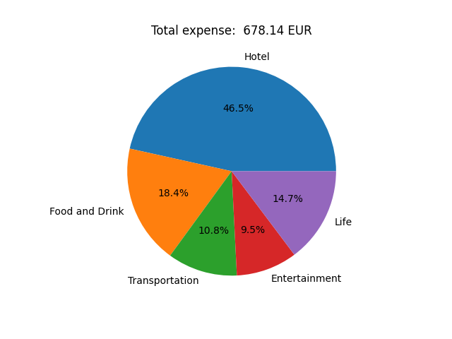

# Analyzing Splitwise Data

## About this repository
This repository contains a Python script to analyze the exported data from [Splitwise](https://www.splitwise.com/). 
The current functionality is to sum up all expenses registered to get a total expense in a desired currency as well as a pie chart with the Splitwise categories to show you what the money was spent on.
Note that a _Hotel_ category has been introduced here, because Splitwise classifies hotels in the _Transportation_ category. 

This can help to keep track on the money spent on a trip and what it was spent on, while not requiring a paid account on Splitwise.

A fake data set ```fake_data.csv``` of a two week trip with three currencies is provided. This data set has the same format as the one obtained by exporting data from Splitwise.

Below you can find the pie chart generated by the code for the provided fake dataset:



## How to use the repo

First, you need to clone the repo
```
git clone https://github.com/DavidUmsonst/splitwise-analyzer.git
cd splitwise-analyzer
```
Set up a virtual environment _(this is an optional step)_
```
python3 -m venv .venv
source .venv/bin/activate
```
Next, run the following to install the necessary packages for executing
```
pip3 install ansitable matplotlib
```

To run the code you need an API key from [Currencybeacon](https://currencybeacon.com/), which one can get with a free account, as well as your data from Splitwise, which one can export as a `.csv` file.

Finally, one needs to edit the script `splitwise_analyzer.py` to add their API key and the file path to the Splitwise data. Optionally, one can choose a desired currency to display the expenses in and to use historical exchange rate data or not. 

Once this is done you can run the script from the command line or the IDE.

> :exclamation: Currently, if there is a comma in the description, the parser of the `.csv` file will not work. 

## Currencybeacon API
The current implementation uses the API from [Currencybeacon](https://currencybeacon.com/), which allows for 5000 API request per month in the free subscription as well as access to historical currency exchange rates.